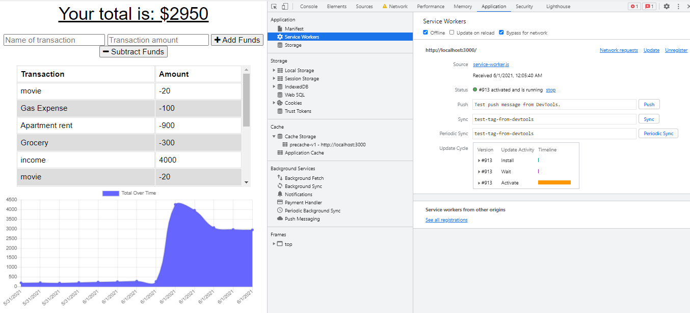

# BUDGET_TRACKER
A web application where users can enter budget-related information while offline.

 ### Table of Contents
 * [Descritption](#description)
 * [Installation](#installation)
 * [Technologies-Used](#technologies-used)
 * [Usage](#usage)
 * [License](#license)
 * [Contribution](#contribution)
 * [Tests](#tests)
 * [Resources](#resources)
 * [Questions](#questions)
___
  ## Description
  Users can enter deposits and expenses no matter if they are online or offline .
  In other words the user will be able to track, add, and subtract funds to/from their budget with or without internet connection . While offline the user can still enter deposits or expenses then once back online the transactions will be added to the tracker so it is updated.
  

## Technologies-Used
* HTML
* CSS
* JavaScript
* Node.js
* Express.js
* NoSQL/MongoDB
* Mongoose
* PWA
* Webpack Config

----

 ## Installation

The application can be viewed live on Heroku here:

For this application to run correctly on your local machine, run npm init -y in the working directory of your choice. Next, install the relevant dependencies by running npm i. Alternatively, you can install the dependencies one at a time .

You will need to make sure that the command mongod is running on your computer, whether that be in a separate Terminal window or if you have chosen the option to allow Mongo to run on your local machine at all times.

Run npm start to start the application. This application runs locally at port 3000.

[Back to Table](#table-of-contents) 

 ## Usage
This application is intended to track deposits and expenses for one user.

A view of the dashboard:

This application has PWA and  which contain three main components: a manifest, service worker, and cache. 

### Web manifest 
The web app manifest provides a list of important information about the applicationin that is stored in a JSON text file. This helps the user have quicker access to the application if installed on their device.
The webpack.config.js file was made first to set up the web manifest and get the bundle.js files created to handle compression. 

### Service Workers 
The service worker  tell what are the opertions that can be performed when the connection is offline. Service worker which is a javascript file that runs serparately from the main browser.

### Cache 
The cache holds information/ pages/ files what you may need to access while offline.

### Application in Offline mode 

   

### Application in Online mode 

   

[Back to Table](#table-of-contents) 

## License 
This project has not yet been licensed, and thus, standard copyright laws apply.

## Contribution
 Nishad Kurup  is the sole contributor to this project. Starter code was provided by the MSU Coding Bootcamp/Trilogy Education Services.

  [Back to Top](#table-of-contents)

  ## Tests
  There are currently no tests written for this project.

  [Back to Top](#table-of-contents)
    

  ## Questions
  If you have any questions about this application my GitHub username is
  [nishadkurup](github.com/nishadkurup) and you can view my GitHub profile at https://github.com/nishadkurup. 

  For any additional questions, feel free to reach out to me at Email: nishadkurup@gmail.com .

